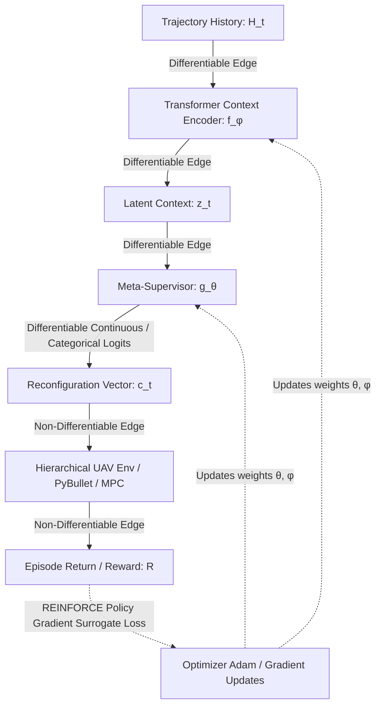

# Phase-10 Meta-RL Training Computational Graph and Differentiability Analysis

This document details the mathematical structure, computational graph, and differentiability properties of the MCR-UAV Meta-RL training pipeline.

---

## 1. Computational Graph Diagram

The computational graph of the MCR-UAV closed-loop adaptation loop is structured as follows:

---

## 2. Detailed Node and Edge Classification

### Node 1: $H_t$ (Trajectory History)
*   **Definition:** The $20 \times 52$ rolling history buffer containing states, actions, rewards, and state increments ($x_k = [s_k, a_k, r_k, \Delta s_k]$).
*   **Differentiability:** Leaf node (constant state inputs).

### Edge 1: $H_t \to \text{Transformer Context Encoder } (f_\phi)$
*   **Classification:** **Differentiable**.
*   **Description:** Consists of linear projection $W_{\text{in}} \in \mathbb{R}^{64 \times 52}$, causal self-attention layers with pre-layer-normalization, padding mask pooling, and linear output projection $W_{\text{out}} \in \mathbb{R}^{16 \times 64}$. Gradients flow continuously.

### Node 2: $z_t$ (Latent Context Embedding)
*   **Definition:** Low-dimensional context embedding $z_t \in \mathbb{R}^{16}$.
*   **Differentiability:** Fully differentiable activation tensor.

### Edge 2: $z_t \to \text{Meta-Supervisor } (g_\theta)$
*   **Classification:** **Differentiable**.
*   **Description:** Maps $z_t \to \mathbb{R}^7$ via a shared trunk (GELU + LayerNorm) and split projection heads.
    *   **Continuous Parameters:** Sigmoid bounding layer:
        $$\alpha = \alpha_{\min} + \sigma(\text{logit}) \cdot (\alpha_{\max} - \alpha_{\min})$$
        which is continuously differentiable.
    *   **Discrete MPC Horizon:** Logits $\text{logits}_H \in \mathbb{R}^3$ are mapped to a Categorical distribution $\pi_H = \text{softmax}(\text{logits}_H)$. During training, $H$ is sampled stochastically from this distribution, and the resulting log-probability contributes to the training loss. During deployment, the horizon is selected deterministically via $H = \text{horizons}[i^*]$ where $i^* = \text{argmax}_i(\text{logits}_H[i])$ and $\text{horizons} = [10, 20, 30]$.
*   **Differentiability:** Fully differentiable.

### Node 3: $c_t$ (Reconfiguration Vector)
*   **Definition:** $c_t = [\lambda_{\text{RL}}, \alpha_Q, \alpha_R, \alpha_P, \alpha_I, \alpha_D, H]^T \in \mathbb{R}^7$.
*   **Differentiability:** Outputs are differentiable with respect to $\phi$ and $\theta$ parameters.

### Edge 3: $c_t \to \text{Hierarchical Controller / PyBullet Environment}$
*   **Classification:** **Non-Differentiable**.
*   **Description:** The physical environment steps are simulated via PyBullet's rigid-body contact equations. The mid-level controller runs an optimization-based Quadratic Programming (QP) MPC solver. The PPO guidance model is frozen. 
*   **Gradient Flow:** **Gradients DO NOT flow back from the environment physics or solver through this edge.** The environment acts as a black box.
*   **Optimization Strategy:** Optimized using a **Policy Gradient (REINFORCE) Surrogate Loss**. Since direct backpropagation is impossible, we treat the Meta-Supervisor as a stochastic policy. The parameter distributions are sampled during rollout, and their log-probabilities are scaled by the empirical task return to calculate gradient steps.

### Node 4: Reward ($r_t$ or $R = \sum_t r_t$)
*   **Definition:** Flight trajectory tracking accuracy and stability score.
*   **Optimized:** **Indirectly optimized**. Maximizing $R$ is achieved by ascending the policy gradient of the supervisor and context encoder parameters.

---

## 3. Horizon Training Treatment (Categorical Stochastic Sampling vs. Deterministic Deployment)

To ensure the horizon decision is trainable, we separate the **training representation** from the **deployment representation**:

1.  **Deployment (Inference):**
    The discrete horizon $H \in \{10, 20, 30\}$ is selected via the argmax over the horizon logits:
    $$i^* = \operatorname{argmax}_i(\text{logits}_H[i])$$
    $$H = \text{horizons}[i^*]$$
    where $\text{horizons} = [10, 20, 30]$.
    This discrete selection is non-differentiable.

2.  **Training (Optimization):**
    During training, we treat $H_t$ as a stochastic categorical choice sampled from the probability distribution $\pi_H = \text{softmax}(\text{logits}_H)$.
    *   The supervisor outputs logits for the horizon options.
    *   We sample the horizon index $i \in \{0, 1, 2\}$ according to $\pi_H$.
    *   We execute the corresponding horizon $H_i \in \{10, 20, 30\}$ in the physical environment.
    *   The training objective computes the log-probability of the sampled horizon:
        $$\log \pi(H_t | H_t) = \log \pi_{H, i}$$
    *   Gradients flow directly through the log-probabilities to the horizon logits, updating the categorical weights.
    *   This ensures the horizon head learns to favor horizons that improve performance without requiring the environment or the MPC solver to be differentiable.
